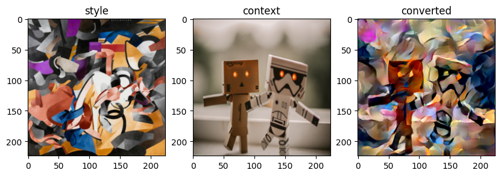
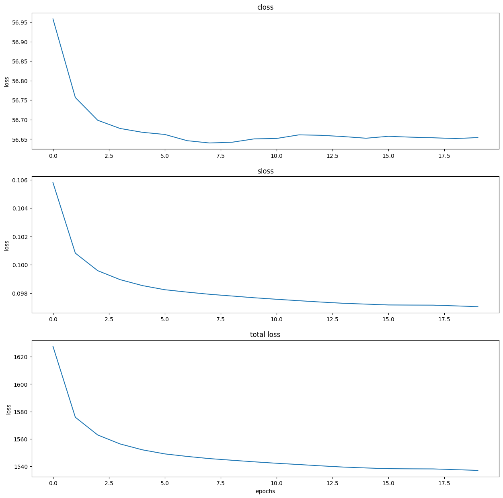

# About
This is a neural style transfer model implemented from 
[this paper](https://arxiv.org/abs/1508.06576) . i used the conv layers for style representations but you can change it to relu layers . to run this code you can run the `main.py` file .
# Example

# Loss Plots For Context Loss and Style Loss and Total Loss

